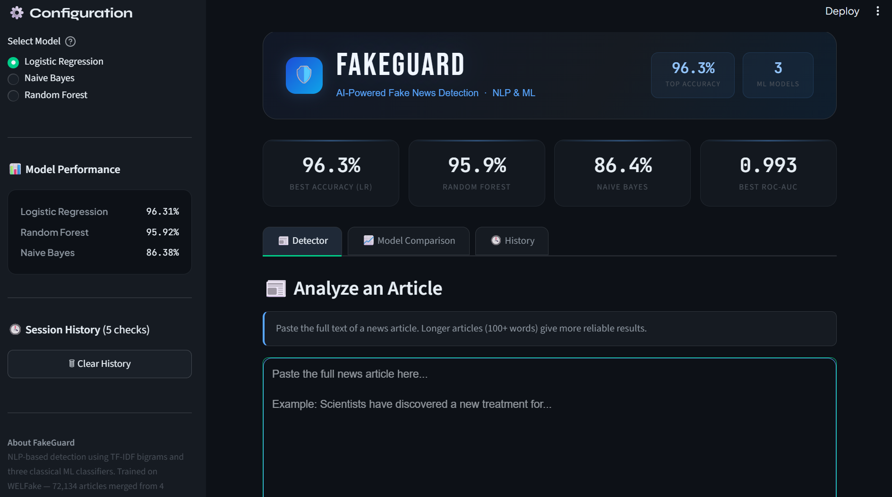

<div align="center">

# 🛡️ FakeGuard

### AI-Powered Fake News Detection System


*Detect misinformation in news articles using NLP and classical ML — trained on 72,134 articles from 4 sources.*

[](https://your-app.streamlit.app)

</div>

---

## 📌 Overview

FakeGuard is an end-to-end fake news detection system built with **TF-IDF vectorization** and three classical ML classifiers. Trained on the **WELFake dataset** — a merged corpus of 72,134 news articles from Kaggle, McIntire, Reuters, and BuzzFeed Political — designed to prevent source-style overfitting that plagues simpler datasets like ISOT.

Paste any news article into the web interface and get an instant FAKE / REAL verdict with confidence score and probability breakdown.

---

## ✨ Features

- **3 ML Models** — Logistic Regression, Random Forest, Naive Bayes
- **Real-time prediction** with confidence gauge and probability bars
- **Model comparison tab** — accuracy, precision, recall, F1, ROC-AUC
- **Session history** — tracks all analyses in the current session
- **Robust preprocessing** — URL removal, HTML stripping, stopword removal, lemmatization

---

## 📊 Model Performance

> Trained and evaluated on WELFake (72,134 articles · 80/20 train-test split)

| Model | Accuracy | Precision | Recall | F1 Score | ROC-AUC |
|---|---|---|---|---|---|
| **Logistic Regression** ⭐ | 96.31% | 95.96% | 96.83% | 96.40% | 0.9927 |
| Random Forest | 95.92% | 95.12% | 96.96% | 96.03% | 0.9930 |
| Naive Bayes | 86.38% | 84.53% | 89.65% | 87.01% | 0.9376 |

> Logistic Regression is the recommended default — highest accuracy with fastest inference.

---

## 🗂️ Project Structure

```
FAKE_NEWS_DETECTOR/
├── data/
│   └── raw/
│       └── WELFake_Dataset.csv     # Download from Kaggle
├── models/
│   ├── logistic_regression.pkl
│   ├── naive_bayes.pkl
│   ├── random_forest.pkl
│   └── tfidf_vectorizer.pkl
├── notebooks/
│   └── fake_news_training.ipynb
├── src/
│   ├── __init__.py
│   ├── predictor.py
│   ├── preprocessor.py
│   └── model_trainer.py
├── app.py
├── requirements.txt
└── README.md
```

---

## 🚀 Getting Started

### 1. Clone the repository

```bash
git clone https://github.com/abhik-kundu09/FakeGuard.git
cd fakeguard
```

### 2. Create a virtual environment

```bash
python -m venv venv
venv\Scripts\activate        # Windows
source venv/bin/activate      # macOS / Linux
```

### 3. Install dependencies

```bash
pip install -r requirements.txt
```

### 4. Download NLTK data

```bash
python -c "import nltk; nltk.download('stopwords'); nltk.download('wordnet'); nltk.download('omw-1.4')"
```

### 5. Train the models *(skip if using pre-trained .pkl files)*

Download [WELFake Dataset](https://www.kaggle.com/datasets/saurabhshahane/fake-news-classification) → place at `data/raw/WELFake_Dataset.csv` → run the notebook.

### 6. Run the app

```bash
streamlit run app.py
```

---

## 🛠️ Tech Stack

| Layer | Technology |
|---|---|
| Frontend | Streamlit, Plotly, HTML/CSS |
| ML | Scikit-learn, TF-IDF |
| NLP | NLTK (stopwords, lemmatizer) |
| Data | Pandas, NumPy |
| Serialization | Joblib |

---

## 🙋 Author

**Abhik Kundu**  
B.Tech Computer Science (AI/ML) · KIIT University

[](https://abhik-kundu.netlify.app)
[](https://github.com/abhik-kundu09)

---

## 📄 License

This project is licensed under the MIT License.

---

<div align="center">
<sub>Built with ❤️ using Streamlit · Scikit-Learn · Plotly</sub>
</div>